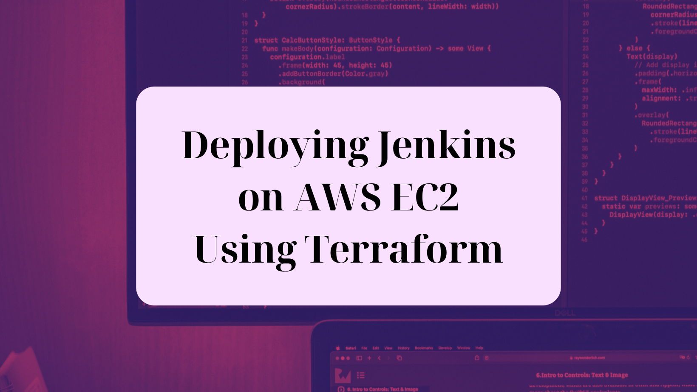

# Terraform Jenkins Project:

## A guide to leveraging Terraform to deploy EC2 instances with bootstrapped Jenkins

Check out my [Hashnode blog post]() for this project!



## Introduction

For this demo project, we will use one main Terraform configuration file in a single directory (a monolithic configuration) to create an EC2 instance with a user data script that will install and start Jenkins at launch time.

If you are new to Infrastructure as Code (IaC), it may help to explain how Terraform works. Terraform is an IaC tool created by HashiCorp that revolutionizes how we build, change, and version infrastructure efficiently. It uses code to manage and provision the infrastructure, both in the cloud and on-premises. Terraform allows developers to define infrastructure through easy-to-understand configuration files, which can then be shared, reviewed, and versioned, making infrastructure management more consistent and predictable. To learn more, visit the official Terraform website.

Jenkins, on the other hand, is a Java-based open-source automation server used to automate the parts of software development related to building, testing, and deploying. With many plugins to choose from, we can use Jenkins to make the integration and continuous delivery of projects more efficient. To learn more, visit the official Jenkins website.

This comprehensive guide covers everything from setting up your Cloud9 environment to the final Jenkins configuration, ensuring you're well-equipped to automate your deployment pipelines.

## Objectives

1. Set up an AWS Cloud9 environment for Terraform development.

2. Deploy an AWS EC2 instance with one main.tf file.

3. Bootstrap the EC2 instance by including a user data script to install and start Jenkins when the instance launches.

4. Secure the Jenkins server with an AWS security group, with inbound rules to allow SSH traffic on port 22 and Jenkins web traffic on port 8080.

5. Access Jenkins in your browser on port 8080.

## Prerequisites

An active AWS account with permissions for EC2, IAM, Security Groups, and Cloud9.

Basic familiarity with AWS services, Terraform, and Jenkins.

## Step 1: Create Your Cloud9 Environment

For this project, you can use AWS Cloud9 as the IDE because it already has Terraform installed. Conversely, you could use another IDE, such as VS Code, if you already have Terraform installed on your local machine and the AWS CLI installed and configured with your AWS access key and secret access key.

Sign in to your AWS account and navigate to the AWS Cloud9 dashboard in your AWS Management Console. Check the region you are in on the top right. In this example, the region is us-east-1 (Northern Virginia). 

/

Click "Create environment." Give the environment a name, such as Terraform-Jenkins and include a brief description. For the Environment type, keep it as "New EC2 instance" and select a t2.micro instance for cost efficiency (free-tier). For the Platform, you can use Amazon Linux 2. Under Network settings, choose "AWS Systems Manager (SSM)" for the Connection, and leave everything else as default. 

/

Click "Create" on the bottom right. Wait a few minutes for setup completion. (Note: Cloud9 creates an EC2 instance and runs on it; by default, after 30 minutes without user input (inactivity) it auto-hibernates.) You can check the EC2 console and go to Instances to see the running instance.

/

/

## Step 2: Preparing Your Cloud9 Environment

In the Cloud9 console, select the environment you created and click on "Open in Cloud9" at the top to launch your Cloud9 environment.

/

Note: If you have chosen to use VS Code, you can use the following commands on your local machine to make sure your AWS CLI is set up and configured and that Terraform is installed:

aws --version # Update if necessary
aws configure # Configure with your access and secret access keys
terraform -v  # Install if not present

## Step 3: Writing Terraform Configuration

Main.tf File

In your Cloud9 environment, you will see the terminal at the bottom, your files and directories on the left panel, and the code editor at the top. Create a new directory and main.tf file using the following commands in the terminal:

mkdir terraform-jenkins && cd terraform-jenkins
touch main.tf

Once your main.tf file is created, open it by

Then, paste the following configurations into main.tf:

**Provider Configuration**

Here you are stating the provider you'd like to use (if you'd like a complete list, visit the Terraform Registry for all the provider options). In this case it is AWS, and we'd like to deploy our infrastructure in us-east-1.

```yaml
terraform {
  required_providers {
    aws = {
      source  = "hashicorp/aws"
      version = "~> 5.0"
    }
  }

  required_version = ">= 1.2.0"
}

#Defines the provider and region to use
provider "aws" {
  region = "us-east-1"
}
```

Remember, Terraform configuration files are written in Hashicorp Configuration Language (HCL) which has a declarative structure. Declarative means you are stating what you would like to see (the final result) in your cloud infrastructure, but you are not telling Terraform how to do it (it takes care of that for you.) To learn more about the Terraform language, visit the Terraform Language Documentation website. Another incredible way to learn about Terraform configuration is to complete more hands-on exercises -- there are lots of official Terraform tutorials to choose from.

**Security Group**

As the first resource, you can define the Security Group for your EC2 instance. In general, you don't need to worry about the specific order of the blocks defining your resources. Here you will give the Security Group a name, include a brief description of what the Security Group does, and define the inbound and outbound rules.

```yaml
#Defines the SG and inbound/outbound rules
resource "aws_security_group" "jenkins" {
  name        = "jenkins-sg"
  description = "Allow SSH and Jenkins web access"

#Allows inbound SSH traffic on port 22 from anywhere
  ingress {
    from_port   = 22
    to_port     = 22
    protocol    = "tcp"
    cidr_blocks = ["0.0.0.0/0"]
  }

#Allows inbound traffic on port 8080 from anywhere
  ingress {
    from_port   = 8080
    to_port     = 8080
    protocol    = "tcp"
    cidr_blocks = ["0.0.0.0/0"]
  }

#Allows all outbound traffic to anywhere
  egress {
    from_port   = 0
    to_port     = 0
    protocol    = "-1"
    cidr_blocks = ["0.0.0.0/0"]
  }
}
```

**EC2 Instance**

For the EC2 instance, you will use another resource block. 

```yaml
#Defines the EC2 instance and arguments
resource "aws_instance" "jenkins" {
  ami           = "ami-02d7fd1c2af6eead0" # Use the latest Amazon Linux 2 AMI for us-east-1
  instance_type = "t2.micro"
  key_name      = "your-key-pair-name" #Replace with the name of your key pair in us-east-1

  security_groups = [aws_security_group.jenkins.name]

  user_data = <<-EOF
            #!/bin/bash
            sudo yum update -y
            sudo wget -O /etc/yum.repos.d/jenkins.repo https://pkg.jenkins.io/redhat-stable/jenkins.repo
            sudo rpm --import https://pkg.jenkins.io/redhat-stable/jenkins.io.key
            sudo yum upgrade
            sudo amazon-linux-extras install java-openjdk11 -y
            sudo yum install jenkins -y
            sudo systemctl enable jenkins
            sudo systemctl start jenkins
            EOF

  user_data_replace_on_change = true

  tags = {
    Name = "jenkins-server"
  }
}
```

For the AMI, head to the EC2 console and check to make sure you are still in the us-east-1 region. The AMI ID will change in different regions, so ensure you are in the correct region. You can click "Launch instance" and find the AMI ID for Amazon Linux 2 under "Application and OS Images (Amazon Machine Image)." Conversely, you can find the AMI ID in the AMI Catalog in the EC2 console.

/

For the instance type, you can use t2.micro because it falls under the free-tier.

Replace your-key-pair-name with your actual AWS key pair name. The key pair is specific to the selected region, and you can choose a key pair here in case you need to SSH into the server. If you do not have a key pair, you can creating it by clicking on:

/

Here you also reference the security group created in the previous resource block: this is important because this will assign the security group to your EC2 instance. Since you do not have the security group ID yet, you reference it by using the name we gave it (jenkins) in the previous security group resource block.

The user data of the EC2 instance allows you to run a bootstrap script. The commands in the script will run at launch time, installing and starting Jenkins as the server boots.

The last part the says user_data_replace_on_change = true simply means that if the user data changes it will destroy the EC2 instance and create a new one, and it will run the new user data script at launch time.

(Note: For official documentation on how to install Jenkins on the server, you can go to the Jenkins website. It covers downloading and installing Jenkins on the Amazon Linux 2023 AMI, not Amazon Linux 2, so some of the commands are different from the ones we need for this demo. The code above should work properly for the Amazon Linux 2 AMI.)

/

This is what your main.tf file should look like in your Cloud9 environment:

/

Now that you have explored the different parts that create your configuration file, you can get the full code [here](./main.tf).

## Step 4: Deploying Jenkins with Terraform

Finally, the time has come to run the Terraform commands and watch how it creates the resources in our account! 

First, run the command terraform init to download the needed plugins.

`terraform init`

Then, check if the syntax of your main.tf is correct by running the following command:

`terraform validate`

Next, to review the resources that will be created, run the command:

`terraform plan`

If the plan looks good and matches our desired infrastructure, run the following command to provision the infrastructure in AWS:

`terraform apply`

Confirm the deployment when prompted.

It will show when the creation of each resource is complete, and it will print "Apply complete!" in green once all resources are created.

In the AWS Management Console, you can navigate to the EC2 service and click on "Instances" on the left panel to find your running instance:

/

Next, let's head to the VPC service in the console, where you can click on "Security groups" under Security on the navigation panel on the left. 

Here, you will find the Security Group you created named "terraform-jenkins-sg." 

/

Click on the Security group ID to view more information about it. Check the inbound and outbound rules to verify that they match the configurations you defined within the main.tf file. There should be two inbound rules allowing traffic on ports 22 and 8080, and one outbound rule allowing traffic to anywhere.

/

## Step 5: Accessing Jenkins

Time to access Jenkins in the web browser! 

It is always a good idea to connect to the instance first and verify through the shell that Jenkins is running. 

You can SSH into your EC2 instance using the key pair you specified in the main.tf file under the EC2 resource. You can do this from your local machine using the terminal. For macOS, you can use Terminal (which is already installed), or you can install iTerm2. For Windows, you can use PuTTY or MobaXterm. (For this you will also need to have your key pair file downloaded on your local machine.)

Select your EC2 instance in the console, and click "Connect" at the top. There will be several tabs to choose from. To SSH into the instance, click on the "SSH client" tab and follow the steps provided to connect.

/

This takes extra steps, so the quickest way to connect to your instance (especially if you did not specify a key pair and can't SSH) is to use EC2 Instance Connect.

/instanceconnect

/instanceconnect

See? Much easier!

Once you are connected and in the shell, run the following command to verify Jenkins is running:

`systemctl status jenkins`

/image

Now that you've checked to ensure Jenkins is running on the EC2 instance, locate your instance's public IP in the console.

/

Access Jenkins by navigating to `http://<Your-EC2-Instance-IP>:8080`.

You should see this landing page in your browser:

/

Congrats, you did it!

This powerful setup introduces an efficient infrastructure as code (IaC) management approach to implementing CI/CD tools like Jenkins and embracing the full potential of DevOps practices.

## Step 6: Wrapping Up

Wrap up the project with some clean up. Destroy the resources you created by running the command:

`terraform destroy`